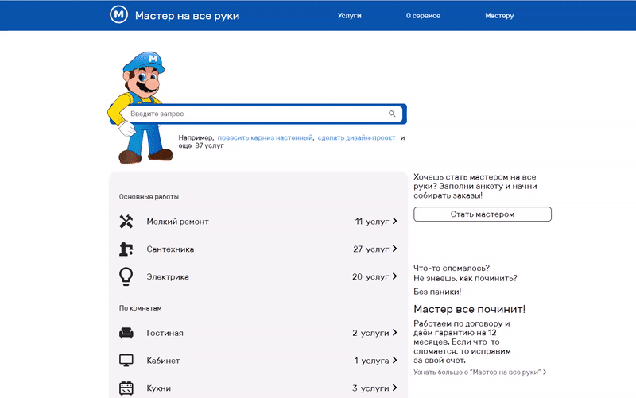

<h1 align="center">MasterHands</h1>
<p align="center">
  
</p>

Using Stack
-----------
SSR isomorphic application in conjunction with NGINX + Django + Express.js + React.js + Redux + PostgreS

## Project setup

```
git clone https://github.com/Ravenfoster/MasterHands.git

python -m venv venv
pip install -r .\requirements.txt

cd MasterHands
python manage.py makemigrations
python manage.py migrate

cd ..
venv\scripts\activate
cd MasterHands
python manage.py runserver

cd frontend
npm install
npm start
```

Remark
----------
In developing
